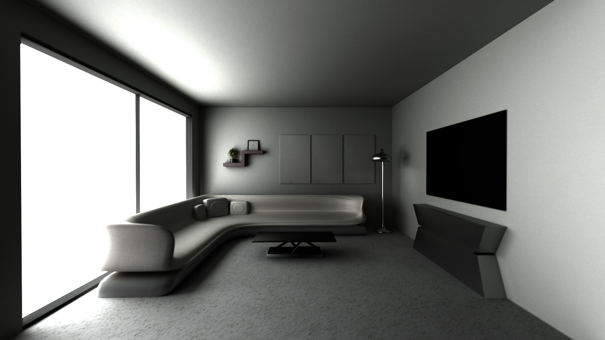
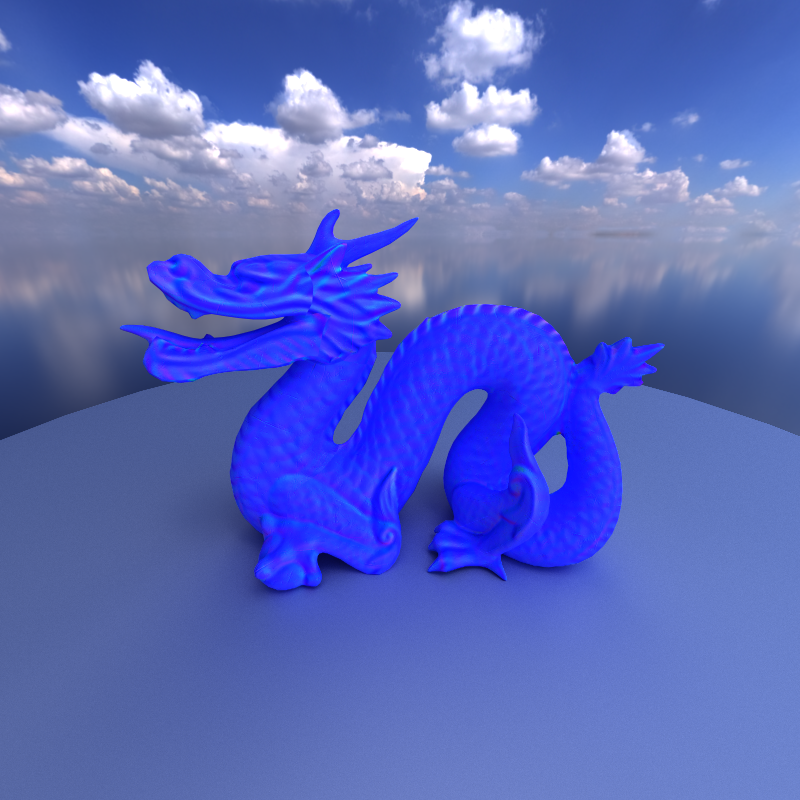

CUDA Path Tracer
======================

**University of Pennsylvania, CIS 565: GPU Programming and Architecture, Project 3**

* Bryce Joseph
* [LinkedIn](https://www.linkedin.com/in/brycejoseph/), [GitHub](https://github.com/brycej217)
* Tested on: Windows 11, Intel(R) CORE(TM) Ultra 9 275HX @ 2.70GHz 32.0GB, NVIDIA GeFORCE RTX 5080 Laptop GPU 16384MB

# CIS 5650 Project 3 - Path Tracer

This project involved creating a path-traced renderer using CUDA. All of the path tracing logic is executed on CUDA kernels, the result of which is transferred to an OpenGL texture object for display.

### Path Tracing
Path tracing is a rendering technique that simulates how light bounces and interacts with surfaces. The process starts by defining a camera, and then shooting rays out 
into the scene from that point. What makes path tracing able to generate such photorealistic renders is that when we shoot out the rays, at the intersection point between the ray 
and the scene geometry, we then shoot out another ray in some direction, based on the intersected material's properties. We then continue this until we reach a specified depth or 
the ray no longer finds an intersection. This is where it gets the name "path tracing", as we are basically tracing the ray as it bounces throughout the scene, adding the colors and radiance 
of the intersected materials at each bounce to the pixel on the image that corresponds with the ray.  

## Visual Improvements
A large part of the visual improvements for the path tracer came from custom mesh and texture loading, and so I am happy to give credit to the [Assimp](https://github.com/assimp/assimp) team for 
their asset loading library. I used Assimp for loading meshes, materials, and textures. Their work allowed me to have a unified system for loading scenes regardless of 3D file format, and allowed me to focus 
on other parts of the project outside of file parsing logic.

### Texture Mapping

Texture mapping is a common technique for adding realism to objects in a scene. This path tracer takes advantage of 3 types of texture mapping, diffuse, normal, and roughness mapping, all 3 of which we can visualize respectively below:  

### Imperfect Specular Reflection

This path tracer utilizes roughness by calculating a specular reflection vector and a diffuse reflection vector (sample from a cosine hemisphere), and mixes between these two based on the roughness of the material. 
This provides a convincing imperfect specular reflection affect without PBR. Above you can see roughness values varying from 0.0 to 1.0 across the grid.  

### Environment Mapping

When a ray does not intersect geometry, rather than simply coloring the pixel based on some clear value, we can instead sample from an image to provide an environment map effect. By adjusting ray radiance by these values 
as well we can provide what is essentially a global light source.

### Depth of Field

To simulate more traditional cameras, we can mimic the effect of a lens by sampling our rays along some simulated aperature. A more comprehensive overview is detailed in [PBRT 5.2.3](https://pbr-book.org/4ed/Cameras_and_Film/Projective_Camera_Models#TheThinLensModelandDepthofField).  
Here's what the above scene looks like without depth of field effects:

### Stochastic Sampled Antialiasing

Antialising in a path tracer is essentially free as we can simply jitter our rays within the pixel each iteration. Thus by adding some noise to our ray directions each iteration we can achieve antialiasing.

## Analysis

Analysis will be performed on the above scenes involving the Stanford dragon, here on dubbed as the "Dragon Box". The scene contains 20,364 triangles, and will serve as the benchmark scene for performance analysis of the path tracer's 
various features. The path tracer was tuned to a resolution of 800 x 800 (for 640,000 rays) with a trace depth of 8. BVH was enabled for all performance comparisons, otherwise all other visual and performance features 
(early termination, material sorting, texture mapping, environment mapping, depth of field) were disabled for baseline benchmarking. Kernel runtime was captured using NSight Systems.

## Performance Improvements
Since our path tracer is being executed on the GPU, we take advantage of the inherit parallelism of the GPU and implement our path tracer using CUDA kernels. Intuitively, each ray corresponds 
to a thread executing on the GPU. This parallelism was further optimized with 3 major techniques, namely bounding volume hierarchies, early termination and material sorting. Below is an analysis of both total iteration runtime 
as well as kernel runtime analysis using NSight Compute, the results of which will be discussed in the feature's respective section:   

  
We will also be discussing the path tracer's performance in closed scenes, which can be scene in the following charts:  

  

### Bounding Volume Hierarchies

To determine which geometries a ray hits, a naive path tracer would check the ray against all geometries in the scene and return the closest hit. This is extremely costly, especially when a scene has 
a lot of geometry. A solution to this is to split up the space into a hierarchichal data structure. Essentially, we can group geometries into enclosing volumes. A ray that does not intersect the enclosing volume could 
not possibly hit any geometry within its volume and so we no longer have to check the ray against those geometries. Taking this to its logical conclusion, we can enforce a tree like data structure where the root encloses all 
geometry in the scene, its children enclose different halves, and so on. Thus, when determining ray intersections, we can simply traverse this tree like structure until we reach a leaf node, each of the geometries of which our rays can test against.    
Ths particular implementation determine a node as terminal if it contained less than or equal to a desired leaf geometry count.    
This path tracer's particular implementation of a BVH utilized details from both [Jacco Bikker's blog](https://jacco.ompf2.com/2022/04/13/how-to-build-a-bvh-part-1-basics/) and [Peter Shirley's Ray Tracing: The Next Week](https://www.realtimerendering.com/raytracing/Ray%20Tracing_%20The%20Next%20Week.pdf). The above visualization 
courtesy of [stororokw](https://www.youtube.com/watch?v=YkxBEEJTFmI) on YouTube.  

The above analysis looks somewhat silly, but it illustrates that bounding volume hierarchies are essentially required for any non-trivial scene. I was almost unable to interact with the path tracer with it disabled, 
iterations taking an unacceptable over 8.7 seconds to execute. As we can see, most of this runtime comes from the compute intersections kernel as expected, shade intersection and ray generation taking the same amount of time as they would with it enabled. Thus, 
BVH provides the most significant performance speedup, improving performance by over 1300%.

### Early Termination

When determining intersections for rays, it is quite common that some rays will not intersect any geometry. However, this could happen at any bounce depth, i.e. some rays will be done sooner than 
others at any point during our path tracing function. The solution is to simply compact the array of active paths to reduce the kernel launch size via stream compaction, a diagram of which can be seen above. 
By terminating paths early, we can reduce the number of threads that must be evaluated in each kernel, the effects of which compound as rays continue to bounce and miss across an iteration.    

As we can see in the performance analysis, stream compaction reduces iteration time for the open scene by about 4.5 ms, increasing FPS by around 2. From NSight Compute, we can see that the average kernel runtime for both compute intersections 
and shade intersections decreased, but from inspection of the NSight report, this is because kernels later on in the iteration take less time to execute due to the reduction of paths they need to evaluate.   
As expected for the closed scene, there is no chance for rays to terminate early, and so performance remains essentially the same as the baseline even with stream compaction on.

### Material Sorting
When an intersection has been determined, we then must access the material in order to determine the contribution of the intersection to the ray's pixel, but also how the ray bounces off the material. 
Regardless, often times rays which are contiguous in memory will intersect with completely different materials, which are more than likely not contiguous in memory. The solution is to sort our rays by their material 
indexes, thus when shading, we reduce memory lookup times.
    
As we can see in the performance analysis, material sorting did not improve performance, but rather reduced it, adding over 15 ms to the iteration runtime. As we can see, material sorting did reduce the runtime of the shade intersection 
kernel as we expected since memory access overhead was reduced. However, it also introduced overhead due to having to sort rays by materials, as seen by the radix sort runtime adding 3 ms to each execution of our path trace function.

## Visual Improvemnts Performance Analysis
Below is an analysis of both total iteration runtime as well as kernel runtime analysis using NSight Compute, the results of which will be discussed in the feature's respective section:   

  

### Texture Mapping
As we can see from the analysis, texture mapping introduced a slight performance cost of 6 ms as compared to the baseline. From the NSight Systems report, most of this runtime was added to the shade intersections kernel, as expected, 
increasing its runtime by about 10 microseconds. Shading is currently being performed in an uber shader, where each material is executing the same large shader which has conditions for different material properties and the existence of texture maps. 
This can certainly be optimized better and could be the target of future work, but at the moment it seems like the runtime of the shading kernel is not the largest performance bottleneck.

### Environment Mapping & Depth of Field
As we can see from the analysis, environment mapping did not lead to any sort of performance impact as compared to the baseline. Similarly, depth of field did not significantly increase the ray generation kernel runtime as we might have expected, 
only increasing its runtime by 10 microseconds, again, neglible when compared to the runtime of our other kernels.

## Future Work
There are several visual and performance improvements I would like to make that would either involve implementing new features or optimizing existing ones. For new features, I plan on adding  
* Physically-Based Rendering
* Refraction
* Subsurface Scattering
* Volumes

For existing features, bounding volume hierarchies can be improved in several ways. Firstly, we can have node child counts above 2, i.e. rather than a simple left and right child we can have several children per node. This could make 
traversing more efficient. Secondly, we can implement DX12/Vulkan style acceleration structures where we define our scene with top level acceleartion structures, and when we traverse into them we then access their bottom level acceleration structures which define per mesh geometry. 
This would allow for much more efficient memory usage than simply having each triangle be its own piece of geometry, and would also allow for things like instancing to take place.

## Credits
Again thank you to the [Assimp team](https://github.com/assimp/assimp) for their asset loading library, Matt Pharr, Wenzel Jakob, and Greg Humphreys of [PBRT](https://pbr-book.org/4ed/Cameras_and_Film/Projective_Camera_Models#TheThinLensModelandDepthofField) for their Monte Carlo path tracing resources, 
and [Jacco Bikker](https://jacco.ompf2.com/2022/04/13/how-to-build-a-bvh-part-1-basics/) and [Peter Shirley](https://www.realtimerendering.com/raytracing/Ray%20Tracing_%20The%20Next%20Week.pdf) for their BVH learning resources. Thank you as well to the Sketchfab artists 
[dylanheyes](https://sketchfab.com/dylanheyes) for their [White Modern Living Room](https://sketchfab.com/3d-models/white-modern-living-room-afb8cb0cbee1488caf61471ef14041e9) asset, [x2w-soda](https://sketchfab.com/x2w-soda) for their [Chiikawa](https://sketchfab.com/3d-models/chiikawa-67171ba268ce4ab6a7f3f94db9c9a8eb) model, 
[znkim](https://sketchfab.com/zinookeem) for their [Usagi](https://sketchfab.com/3d-models/usagi-chiikawa-4353fc3c1f664784bfd33608c6cff125) model, [abhayexe](https://sketchfab.com/abhayexe) for their [Chinese Statue VR](https://sketchfab.com/3d-models/chinese-statue-vr-a5089f8d5d2045ef9d1f4b25176a84c6) model, 
and [JHS-Art](https://sketchfab.com/Nidhoeggr) for their [Dragon Wacom](https://sketchfab.com/3d-models/dragon-wacom-penholder-or-tabletop-figure-9fd9fb3d4bc64c2fb56640ab620b72f4) model.    
  
And thank you for reading!